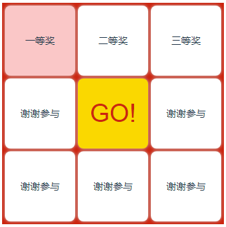

# 介绍

## 安装

```javascript
    npm install --save-dev mt-lottery
```

## 声明

> main.js
```javascript
    import mtlottery from 'mt-lottery'
    Vue.use(mtlottery)
```

## 使用

```html
    <template>
        <div>
            <Lottery 
                ref="mtlottery" 
                v-on:onsubmit="onsubmit" 
                v-on:onend="onend" 
                v-bind:list="list"
            ></Lottery>
        </div>
    </template>
```
```javascript
    export default {
        data () {
            return {
                //list奖品列表，不满8个会自动填满8个，内容是：谢谢参与；超过8个会截取前8个
                list: [
                    {
                        label: '一等奖',
                    },{
                        label: '二等奖',
                    },{
                        label: '三等奖',
                    },
                ]
            }
        },
        methods: {
            onsubmit(){
                //开始抽奖，传参为中间的索引值（list索引值/下标）
                this.$refs.mtlottery.go(5)
            },
            onend(data){
                console.log('抽奖结果回调：',data)
            }
        }
    }
```

效果图

